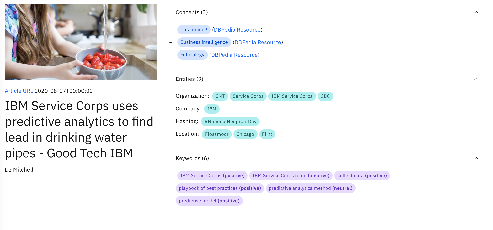
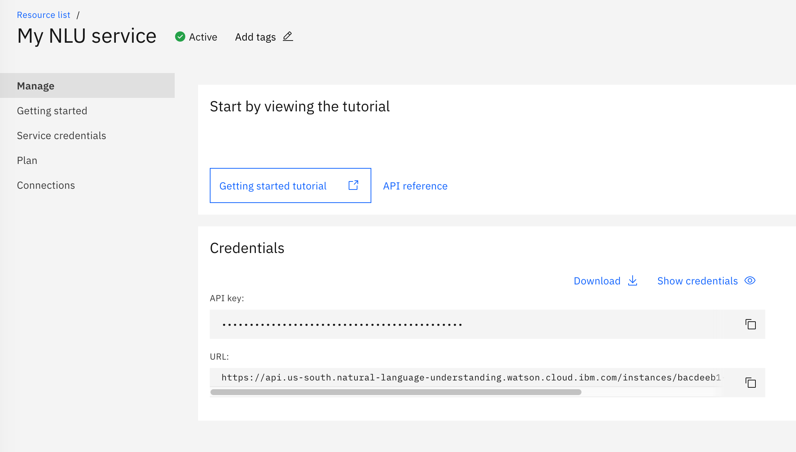

# svelte-intro

> Learn core Svelte concepts by building a web app with [Watson Natural Language Understanding](https://www.ibm.com/cloud/watson-natural-language-understanding) and the [Carbon Design System](https://www.carbondesignsystem.com/).

## Table of Contents

- [Background](#background)
- [Learning objectives](#learning-objectives)
- [Slides](#slides)
- [Running locally](#running-locally)
  - [Prerequisites](#prerequisites)
  - [1. Create a Watson NLU service](#1-create-a-watson-nlu-service)
  - [2. Configure your environment](#2-configure-your-environment)
  - [3. Install project dependencies](#3-install-project-dependencies)
    - [Project structure](#project-structure)
  - [4. Run the app](#4-run-the-app)
  - [5. Build the app](#5-build-the-app)
- [Resources](#resources)

## Background

[Svelte](https://svelte.dev/) is a compiler used to build user interfaces and frontend web applications. Compared to libraries and frameworks like React, Vue and Angular, Svelte performs most optimizations at the build step, reducing the amount of JavaScript shipped to the user. In addition, what makes Svelte appealing is its concise language syntax and usage of the label operator (\$:) to denote reactive assignments, declarations and statements.

[Watson Natural Language Understanding](https://www.ibm.com/cloud/watson-natural-language-understanding) (NLU) is an IBM Cloud advanced text analytics service. It provides a number of APIs to extract entities, keywords, concepts (and more) as well as sentiment analysis.

## Learning objectives

In this workshop, we will learn core Svelte concepts by analyzing several articles from the [IBM Corporate Social Responsibility blog](https://www.ibm.com/blogs/corporate-social-responsibility/) using Watson NLU. We will use the [Carbon Design System](https://www.carbondesignsystem.com/) – IBM's open source digital product design system – to build out the UI.

**Svelte concepts**

- component props/state
- reactivity
- lifecycle methods
- two-way binding



## Slides

[TBD]

## Running locally

### Prerequisites

- [IBM Cloud](https://cloud.ibm.com/) account (sign up: [https://ibm.biz/BdqVLm](https://ibm.biz/BdqVLm))
- [Watson NLU service](https://www.ibm.com/cloud/watson-natural-language-understanding)
- [Node.js](https://nodejs.org/en/)
- [yarn](https://classic.yarnpkg.com/en/docs/install#mac-stable) or [npm](https://www.npmjs.com/get-npm)

### 1. Create a Watson NLU service

After signing up for an IBM Cloud account, navigate to the [Watson Natural Language Understanding service](https://cloud.ibm.com/catalog/services/natural-language-understanding) in the Cloud catalog.

Create a new service. You can customize the region and service name.


### 2. Configure your environment

After provisioning an NLU service, add the service credentials to your local environment.

Credentials needed:

- API Key
- Service endpoint URL

Locate the credentials on the service instance page.



Rename the sample environment file `.env.sample` to `.env`.

**Note: `.env` is ignored by git and should not be checked into source control.**

```sh
mv .env.sample .env
```

Copy the API key and URL values into `.env`:

```diff
#.env

- API_KEY=
+ API_KEY=<YOUR_API_KEY>

- URL=
+ URL=<YOUR_URL>
```

### 3. Install project dependencies

Use yarn or npm to install the local project dependencies.

```sh
yarn install
# OR
npm install
```

#### Project structure

The frontend consists of Svelte and [webpack](https://webpack.js.org/).

The backend is an [Express](https://github.com/expressjs/express) server that uses the [IBM Watson Node.js SDK](https://github.com/watson-developer-cloud/node-sdk) to interact with the NLU service.

```js
│
└───.env // file containing service credentials
└───server.js // Express server
└───src
    └──App.svelte // Svelte sources
    └──index.html // HTML template
    └──index.js // entrypoint
```

### 4. Run the app

This command runs the app in development mode. The Express server spawns on port 3000 while webpack will serve the frontend (compiled from `src`) on port 8080.

Changes made to files in the `src` folder or `server.js` will trigger a reload.

```sh
yarn dev
# OR
npm run dev
```

Visit [http://localhost:8080/](http://localhost:8080/).

### 5. Build the app

This command instructs webpack to build the frontend app for production. The minified, static assets are outputted to the `build` folder, which the Express server will serve.

```sh
yarn build
# OR
npm run build
```

Finally, run `yarn start` or `npm run start` to start the app.

---

## Resources

[Watson Natural Language Understanding API documentation](https://cloud.ibm.com/apidocs/natural-language-understanding) (IBM Cloud)

[IBM Developer](https://developer.ibm.com/)

[Introduction to Svelte and its core concepts](https://developer.ibm.com/tutorials/svelte-introduction/)
(IBM Developer)
